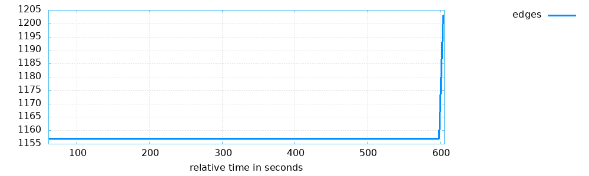
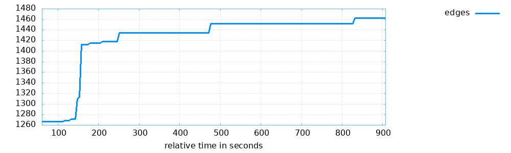
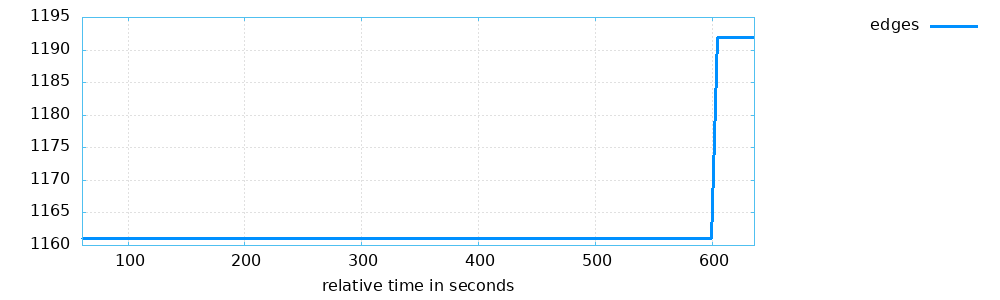
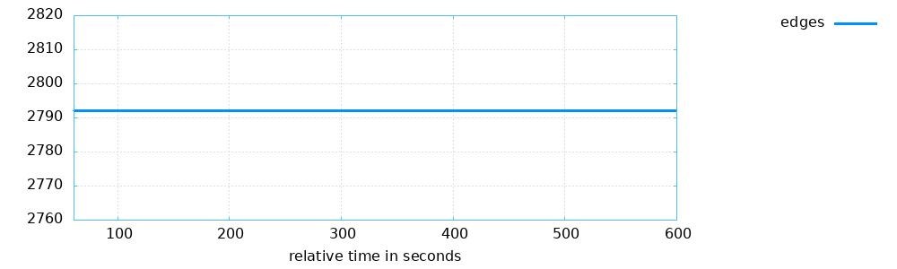

# Evaluation

For evaluation, I mainly used paths explored, since besides CADET_0001 I couldn't find any crashes. Following is the paths explored for plain run, Instance 1, Instance 2, Instance 3 based on greeter binary.

## Plain

## Instance 1

## Instance 2

## Instance 3

Since my project combines Instance 1,2,3 it explores much more paths compared to plain run for the same run time. Also, plain run resulted in around 50 exec/sec, whereas parallel run of 3 Instances resulted in around 120 exec/sec, which is a good speedup.